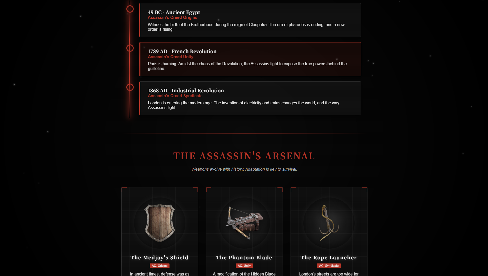
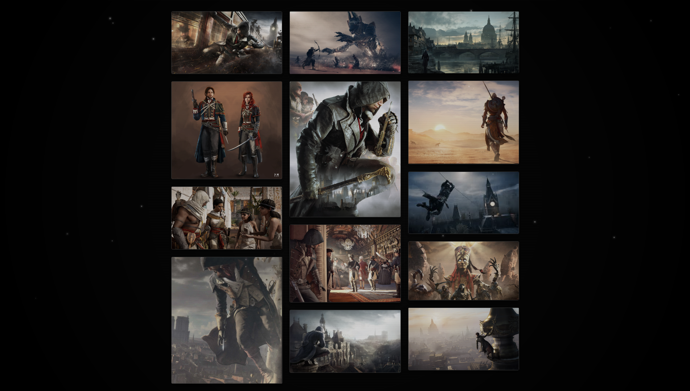

# Explore History By Assassin's Creed

> "Nothing is true, everything is permitted."

這是一個基於《刺客教條》系列世界觀的互動式歷史探索網站。本專案模擬了 Animus 操作介面，結合高互動性的前端技術，帶領使用者穿越古埃及、法國大革命與工業革命時期的倫敦，探索遊戲背後的真實歷史。

**Live Demo (線上預覽):** [https://puaat.github.io/AAT/](https://puaat.github.io/AAT/)

---

## Interface Overview (介面預覽)

本專案強調沉浸式的視覺體驗與互動設計。以下是系統核心介面的實機運行畫面：

### 1. The Museum - 互動式歷史展覽
整合了脈衝時間軸 (Interactive Timeline) 與虛實對照分析 (History vs. Game)，利用 CSS 動畫模擬雷射掃描效果，呈現數據化的歷史資料。

### 2. Art of the Creed - 瀑布流藝廊
採用 Masonry Layout (瀑布流排版) 技術，展示概念美術圖。每張卡片皆具備 Animus 風格的互動特效與 Lightbox 燈箱功能。

### 3. Secure Uplink - 模擬終端機
將傳統的聯絡表單轉化為駭客終端機介面。包含左側的全球情報監控面板，以及右側整合 Formspree API 的加密通訊系統。

---

## System Features (系統功能)

本專案包含以下技術特點：

### 1. Immersive UI (沉浸式介面)
- **Animus Grid System**: 使用 CSS 繪製網格背景與暗角，模擬系統載入畫面。
- **CRT Scanline Overlay**: 覆蓋復古掃描線濾鏡，還原終端機質感。
- **Glitch Effects**: 在標題文字加入數位訊號不穩定的解碼特效。

### 2. Visual Experience (視覺體驗)
- **Parallax Scrolling**: 實作全螢幕視差過場，創造電影般的閱讀節奏。
- **Video Hero Header**: 首頁採用動態影片作為開場背景。
- **3D Tilt Effect**: 圖片與卡片具備物理感應，隨滑鼠角度進行 3D 懸浮轉動。

### 3. Functionality (功能實作)
- **Encrypted Terminal**: 模擬終端機風格的聯絡表單。
- **API Integration**: 整合 Formspree API，實現靜態網頁的郵件發送功能。

---

## Tech Stack (技術工具)

- **Core**: HTML5, CSS3, JavaScript (ES6+)
- **Layout**: CSS Grid, Flexbox
- **Effects**: Keyframes Animation, Glassmorphism
- **Tools**: VS Code, Git, GitHub Pages

---

## AAT Squad (開發團隊)

**Project: AAT ARCHIVE**

- **Alex** (Lead Architect)
- **Allen** (Grand Master of Ideation)
- **Tim** (Tactical Support)

---

© 2025 AAT Squad. All Assassin's Creed assets are property of Ubisoft.